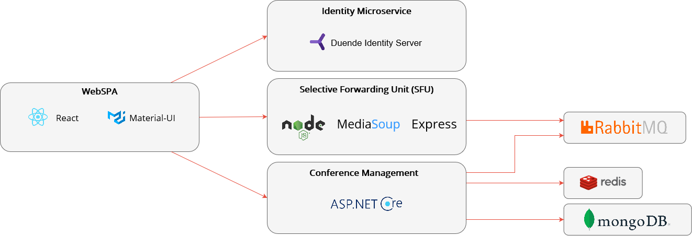

[](https://github.com/Anapher/Strive/actions/workflows/asp-net-core-test.yml)
[](https://codecov.io/gh/Anapher/Strive)
[](https://codeclimate.com/github/Anapher/Strive/maintainability)
[](./LICENSE)

<br />
<p align="center">
  <h1 align="center">Strive</h1>

  <p align="center">
    Open source video conference system
    <br />
    <br />
    <a href="https://demo.openstrive.org/">View Demo</a>
    ·
    <a href="https://github.com/Anapher/Strive/issues">Report Bug</a>
    ·
    <a href="https://github.com/Anapher/Strive/issues">Request Feature</a>
  </p>
</p>


## Table of content

- [About the project](#about-the-project)
    - [Architecture](#architecture)
- [Getting Started](#getting-started)
    - [Running on localhost with Docker Compose and Traefik](#running-on-localhost-with-docker-compose-and-traefik)
    - [Running on production server](#running-on-production-server)
    - [Development](#development)
- [Page setup](#page-setup)
    - [Upload the page tree file](#upload-the-page-tree-file)
    - [Go to the import view](#go-to-the-import-view)
    - [Import the page tree](#import-the-page-tree)
    - [SEO-friendly URLs](#seo-friendly-urls)
- [License](#license)
- [Links](#links)


## About The Project
Last year when I was tutor at my university, I had to use BigBlueButton which was a very frustrating experience. I wondered how hard it can be to create a video conference system and that's how Strive was started. You can find a list with issues of BBB I wanted to address [here](./advantages_over_bbb.md).

### Architecture



<!-- GETTING STARTED -->
## Getting Started

### Running on localhost with Docker Compose and Traefik
1. Clone the repo
   ```sh
   git clone https://github.com/Anapher/Strive.git
   ```
   
2. Got to src directory
   ```sh
   cd src/
   ```
3. Execute docker compose using the script
   - On Windows, execute
   ```powershell
   ./compose.ps1 up --build
   ```
   - On Linux, execute
   ```sh
   chmod +x ./compose.sh && ./compose.sh up --build
   ```
   
In the `.env` file, you can change some parameters, but they are already preconfigured for local testing.

### Running on production server
Please refer to the [installation instructions](./installation.md).

### Development
For developing, you likely want to focus on one microservice only. First of all, you need to setup the infrastructure, namely a RabbitMQ server (with delayed message exchange plugin) and a MongoDB database, both running on default ports.
The easiest way to do so is by executing
   ```sh
   docker-compose -f docker-compose.yml -f docker-compose.override.yml up nosqldata rabbitmq
   ```
   
Then you need to start the required microservices you do NOT want to modify:
- Identity microservice (runs on `http://localhost:55105`):
   ```sh
   cd src/Services/Identity/Identity.API && dotnet run
   ```
- WebSPA (runs on `http://localhost:55103`):
   ```sh
   cd src/Web/WebSPA && dotnet run
   ```
  Do not use yarn start in the ClientApp folder, as the ASP.Net Core app injects some parameters required for the frontend to work.
- SFU (runs on `http://localhost:3000`)
   ```sh
   cd src/Services/SFU && yarn dev
   ```
- Conference Management (runs on `http://localhost:55104`)
   ```sh
   cd src/Services/ConferenceManagement/Strive && dotnet run
   ```
Do not change these ports as they are by configured to work together in a local development environment.
